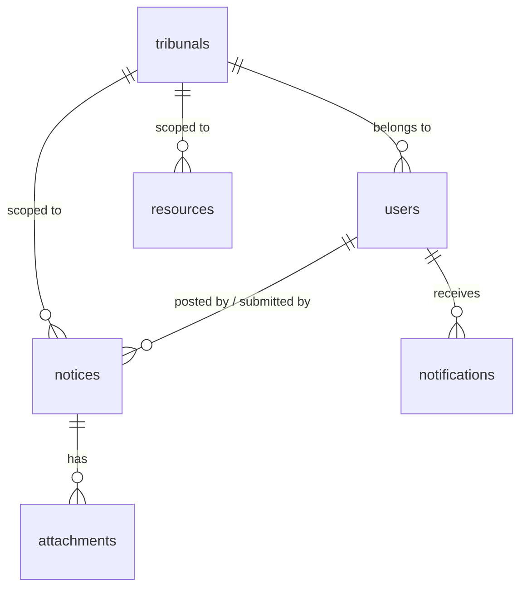

# Database Schema — Judiciary Internal Notice Board

This document describes the complete SQLite database schema for the Internal Notice Board system. Follow the instructions below to create the database, understand every table and column, and seed it with initial data.

---

## Table of Contents

- [Setup Instructions](#setup-instructions)
- [Tables Overview](#tables-overview)
- [Table Definitions](#table-definitions)
  - [users](#1-users)
  - [tribunals](#2-tribunals)
  - [notices](#3-notices)
  - [attachments](#4-attachments)
  - [resources](#5-resources)
  - [notifications](#6-notifications)
- [Indexes](#indexes)
- [Sample Seed Data](#sample-seed-data)
- [Notes & Conventions](#notes--conventions)

---

## Setup Instructions

### 1. Install SQLite

**Windows**
```powershell
# Option A — Download the precompiled binary from https://www.sqlite.org/download.html
# and add it to your PATH.

# Option B — Use winget (Windows Package Manager)
winget install SQLite.SQLite
```

**macOS**
```bash
brew install sqlite
```

**Linux (Debian/Ubuntu)**
```bash
sudo apt update && sudo apt install sqlite3
```

Verify installation:
```bash
sqlite3 --version
# e.g. 3.45.1 2024-01-30 ...
```

---

### 2. Create the Database File

Navigate to your project's backend directory (or create one) and run:

```bash
# Create the database and run the schema script
sqlite3 database.db < schema.sql
```

Or open an interactive session:
```bash
sqlite3 database.db
```

Then paste the SQL statements from the sections below.

---

### 3. Enable Foreign Keys

SQLite does **not** enforce foreign keys by default. Add this line at the top of `schema.sql` or run it at the start of every connection:

```sql
PRAGMA foreign_keys = ON;
```

---

### 4. Verify the Schema

After running the script, confirm all tables were created:

```sql
.tables
-- Expected output:
-- attachments    notifications  resources      tribunals
-- notices        users
```

Check a table's structure:
```sql
.schema users
```

---

## Tables Overview



| Table | Purpose |
|---|---|
| `tribunals` | Master list of tribunals |
| `users` | Staff and admin accounts |
| `notices` | All notices and staff memo submissions |
| `attachments` | Files attached to notices |
| `resources` | Standalone shared documents (forms, circulars) |
| `notifications` | In-app notification records per user |

---

## Table Definitions

### 1. `users`

Stores all user accounts. Login requires a **User ID** and **password**.

```sql
CREATE TABLE IF NOT EXISTS users (
    id            INTEGER PRIMARY KEY AUTOINCREMENT,

    -- Login credentials
    user_id       TEXT    NOT NULL UNIQUE,          -- e.g. "ST-001", "ET-007"
    password_hash TEXT    NOT NULL,                 -- bcrypt / argon2 hash — never store plain text

    -- Identity
    full_name     TEXT    NOT NULL,                 -- e.g. "Jane Otieno"
    email         TEXT    UNIQUE,                   -- optional, for future email notifications

    -- Role & tribunal
    role          TEXT    NOT NULL                  -- "admin" or "staff"
                  CHECK (role IN ('admin', 'staff')),
    tribunal_id   INTEGER NOT NULL                  -- foreign key → tribunals.id
                  REFERENCES tribunals(id) ON DELETE RESTRICT,

    -- Account state
    is_active     INTEGER NOT NULL DEFAULT 1        -- 1 = active, 0 = deactivated
                  CHECK (is_active IN (0, 1)),

    -- Timestamps
    created_at    TEXT    NOT NULL DEFAULT (datetime('now')),
    last_login_at TEXT                              -- updated on each successful login
);
```

#### Column Details — `users`

| Column | Type | Required | Description |
|---|---|---|---|
| `id` | INTEGER | auto | Internal primary key |
| `user_id` | TEXT | ✅ | Unique login identifier given to the user (e.g. `ST-001`) |
| `password_hash` | TEXT | ✅ | Hashed password. **Never store plain text.** Use bcrypt or argon2 |
| `full_name` | TEXT | ✅ | User's display name |
| `email` | TEXT | ➖ | Email address for future notifications |
| `role` | TEXT | ✅ | Either `"admin"` or `"staff"` |
| `tribunal_id` | INTEGER | ✅ | Which tribunal this user belongs to |
| `is_active` | INTEGER | ✅ | `1` = active (can log in), `0` = deactivated |
| `created_at` | TEXT | ✅ | ISO-8601 timestamp, set automatically |
| `last_login_at` | TEXT | ➖ | Updated each time the user logs in successfully |

---

### 2. `tribunals`

Master reference table. Seeded once and rarely changed.

```sql
CREATE TABLE IF NOT EXISTS tribunals (
    id           INTEGER PRIMARY KEY AUTOINCREMENT,
    name         TEXT    NOT NULL UNIQUE,           -- e.g. "Sports Tribunal"
    short_code   TEXT    NOT NULL UNIQUE,           -- e.g. "ST", "ET", "RT"
    color_hex    TEXT    NOT NULL DEFAULT '#123423' -- UI accent color for this tribunal
);
```

#### Column Details — `tribunals`

| Column | Type | Required | Description |
|---|---|---|---|
| `id` | INTEGER | auto | Primary key |
| `name` | TEXT | ✅ | Full tribunal name |
| `short_code` | TEXT | ✅ | 2–4 letter code used in notice reference numbers |
| `color_hex` | TEXT | ✅ | Hex color used in the UI to distinguish this tribunal |

---

### 3. `notices`

The core table. Stores both **admin-published notices** and **staff memo submissions** in one table, distinguished by `status` and `submitted_by`.

```sql
CREATE TABLE IF NOT EXISTS notices (
    id            INTEGER PRIMARY KEY AUTOINCREMENT,

    -- Reference number
    ref           TEXT    NOT NULL UNIQUE,          -- e.g. "INT/NTC/2026/041"

    -- Scope
    tribunal_id   INTEGER                           -- NULL means "Public" (all tribunals)
                  REFERENCES tribunals(id) ON DELETE SET NULL,
    is_public     INTEGER NOT NULL DEFAULT 0        -- 1 = visible to all tribunals
                  CHECK (is_public IN (0, 1)),

    -- Content
    title         TEXT    NOT NULL,
    body          TEXT    NOT NULL,
    notice_date   TEXT    NOT NULL,                 -- ISO-8601 date, e.g. "2026-07-12"
    is_urgent     INTEGER NOT NULL DEFAULT 0        -- 1 = pinned to top as urgent
                  CHECK (is_urgent IN (0, 1)),

    -- Workflow
    status        TEXT    NOT NULL DEFAULT 'pending'
                  CHECK (status IN ('pending', 'approved', 'rejected')),
    reject_reason TEXT,                             -- populated when status = 'rejected'

    -- Attribution
    posted_by     INTEGER                           -- user.id of admin who published
                  REFERENCES users(id) ON DELETE SET NULL,
    submitted_by  INTEGER                           -- user.id of staff who submitted the memo
                  REFERENCES users(id) ON DELETE SET NULL,

    -- Timestamps
    created_at    TEXT NOT NULL DEFAULT (datetime('now')),
    updated_at    TEXT NOT NULL DEFAULT (datetime('now'))
);
```

#### Column Details — `notices`

| Column | Type | Required | Description |
|---|---|---|---|
| `id` | INTEGER | auto | Primary key |
| `ref` | TEXT | ✅ | Human-readable reference number. Format: `INT/NTC/YYYY/NNN` |
| `tribunal_id` | INTEGER | ➖ | The tribunal this notice is scoped to. `NULL` when `is_public = 1` |
| `is_public` | INTEGER | ✅ | `1` = visible to all tribunals ("Public" notices) |
| `title` | TEXT | ✅ | Notice headline |
| `body` | TEXT | ✅ | Full notice text |
| `notice_date` | TEXT | ✅ | The date displayed on the notice card (not the creation timestamp) |
| `is_urgent` | INTEGER | ✅ | `1` = pinned to the top with urgent styling |
| `status` | TEXT | ✅ | `pending` (awaiting admin review), `approved` (published), `rejected` |
| `reject_reason` | TEXT | ➖ | Admin's note to the submitter when rejecting a memo |
| `posted_by` | INTEGER | ➖ | Admin user ID who published the notice. `NULL` for staff-submitted memos |
| `submitted_by` | INTEGER | ➖ | Staff user ID who submitted the memo. `NULL` for admin-posted notices |
| `created_at` | TEXT | ✅ | Record creation timestamp |
| `updated_at` | TEXT | ✅ | Last modification timestamp (update with a trigger or in app code) |

---

### 4. `attachments`

Files attached to notices. Kept in a separate table to support multiple attachments per notice in future.

```sql
CREATE TABLE IF NOT EXISTS attachments (
    id          INTEGER PRIMARY KEY AUTOINCREMENT,
    notice_id   INTEGER NOT NULL
                REFERENCES notices(id) ON DELETE CASCADE,

    file_name   TEXT    NOT NULL,                   -- e.g. "Hearing-Schedule-Revised.pdf"
    file_size   TEXT,                               -- human-readable, e.g. "340 KB"
    file_url    TEXT,                               -- link to file storage (drive URL, S3, etc.)
    mime_type   TEXT,                               -- e.g. "application/pdf"

    uploaded_at TEXT NOT NULL DEFAULT (datetime('now'))
);
```

#### Column Details — `attachments`

| Column | Type | Required | Description |
|---|---|---|---|
| `id` | INTEGER | auto | Primary key |
| `notice_id` | INTEGER | ✅ | The notice this file belongs to. Deletes with the notice (CASCADE) |
| `file_name` | TEXT | ✅ | Original file name shown in the UI |
| `file_size` | TEXT | ➖ | Human-readable file size (e.g. `"340 KB"`) |
| `file_url` | TEXT | ➖ | External URL or path to the stored file. `NULL` if not yet uploaded |
| `mime_type` | TEXT | ➖ | MIME type for rendering/download hints |
| `uploaded_at` | TEXT | ✅ | Upload timestamp |

---

### 5. `resources`

Standalone shared documents (forms, templates, circulars) that admins add to the Documents library. These are **not** linked to a specific notice.

```sql
CREATE TABLE IF NOT EXISTS resources (
    id          INTEGER PRIMARY KEY AUTOINCREMENT,

    name        TEXT    NOT NULL,                   -- e.g. "Leave Application Form"
    description TEXT,                               -- short description shown in the UI
    file_url    TEXT    NOT NULL,                   -- link to the document
    file_size   TEXT,                               -- e.g. "120 KB"

    -- Scope
    tribunal_id INTEGER                             -- NULL = Public (all tribunals)
                REFERENCES tribunals(id) ON DELETE SET NULL,
    is_public   INTEGER NOT NULL DEFAULT 0
                CHECK (is_public IN (0, 1)),

    -- Attribution
    uploaded_by INTEGER
                REFERENCES users(id) ON DELETE SET NULL,

    resource_date TEXT NOT NULL,                    -- the date shown in the UI
    created_at    TEXT NOT NULL DEFAULT (datetime('now'))
);
```

#### Column Details — `resources`

| Column | Type | Required | Description |
|---|---|---|---|
| `id` | INTEGER | auto | Primary key |
| `name` | TEXT | ✅ | Document name displayed in the Documents tab |
| `description` | TEXT | ➖ | Optional short description |
| `file_url` | TEXT | ✅ | URL to the document (shared drive, S3, etc.) |
| `file_size` | TEXT | ➖ | Human-readable size |
| `tribunal_id` | INTEGER | ➖ | Tribunal scope. `NULL` when `is_public = 1` |
| `is_public` | INTEGER | ✅ | `1` = visible to all tribunals |
| `uploaded_by` | INTEGER | ➖ | Admin who added this resource |
| `resource_date` | TEXT | ✅ | Display date shown in the Documents tab |
| `created_at` | TEXT | ✅ | Record creation timestamp |

---

### 6. `notifications`

Stores per-user notification records for the in-app notification bell.

```sql
CREATE TABLE IF NOT EXISTS notifications (
    id          INTEGER PRIMARY KEY AUTOINCREMENT,

    user_id     INTEGER NOT NULL
                REFERENCES users(id) ON DELETE CASCADE,

    title       TEXT NOT NULL,                      -- short notification headline
    meta        TEXT,                               -- secondary line (e.g. tribunal, date)
    notice_ref  TEXT,                               -- optional: links to a specific notice ref
    is_read     INTEGER NOT NULL DEFAULT 0
                CHECK (is_read IN (0, 1)),

    created_at  TEXT NOT NULL DEFAULT (datetime('now'))
);
```

#### Column Details — `notifications`

| Column | Type | Required | Description |
|---|---|---|---|
| `id` | INTEGER | auto | Primary key |
| `user_id` | INTEGER | ✅ | The user this notification belongs to |
| `title` | TEXT | ✅ | Notification headline (e.g. `"✓ Your memo was approved"`) |
| `meta` | TEXT | ➖ | Supporting text shown below the title |
| `notice_ref` | TEXT | ➖ | Reference number of the related notice (e.g. `"INT/NTC/2026/041"`) |
| `is_read` | INTEGER | ✅ | `0` = unread (shows dot), `1` = read |
| `created_at` | TEXT | ✅ | When the notification was created |

---

## Indexes

Add these indexes to improve query performance:

```sql
-- Speed up notice filtering by tribunal and status
CREATE INDEX IF NOT EXISTS idx_notices_tribunal  ON notices(tribunal_id);
CREATE INDEX IF NOT EXISTS idx_notices_status    ON notices(status);
CREATE INDEX IF NOT EXISTS idx_notices_date      ON notices(notice_date DESC);

-- Speed up "My Submissions" queries for a given staff member
CREATE INDEX IF NOT EXISTS idx_notices_submitted_by ON notices(submitted_by);

-- Speed up notification panel queries
CREATE INDEX IF NOT EXISTS idx_notifications_user ON notifications(user_id, is_read);

-- Speed up resource scoping
CREATE INDEX IF NOT EXISTS idx_resources_tribunal ON resources(tribunal_id);
```

---

## Sample Seed Data

Run these `INSERT` statements to populate the database with the same initial data currently used in the JavaScript app.

### Tribunals

```sql
INSERT INTO tribunals (name, short_code, color_hex) VALUES
  ('Sports Tribunal',                  'ST',   '#123423'),
  ('Employment Tribunal',              'ET',   '#2C5F7C'),
  ('Rent Tribunal',                    'RNT',  '#8C7220'),
  ('Business Premises Rent Tribunal',  'BPRT', '#4A5A3E'),
  ('Rent Restriction Tribunal',        'RRT',  '#7A2E2E'),
  ('Cooperative Tribunal',             'CT',   '#64615A');
```

### Users

> **Important:** Replace `'hashed_password_here'` with an actual bcrypt/argon2 hash. Never insert a plain text password.

```sql
-- Admin user for Sports Tribunal (tribunal_id = 1)
INSERT INTO users (user_id, password_hash, full_name, email, role, tribunal_id)
VALUES ('ST-ADM-001', 'hashed_password_here', 'Admin User', 'admin@tribunals.go.ke', 'admin', 1);

-- Staff user for Sports Tribunal
INSERT INTO users (user_id, password_hash, full_name, email, role, tribunal_id)
VALUES ('ST-001', 'hashed_password_here', 'Jane Otieno', 'j.otieno@tribunals.go.ke', 'staff', 1);
```

### Sample Notice

```sql
INSERT INTO notices (ref, tribunal_id, is_public, title, body, notice_date, is_urgent, status, posted_by)
VALUES (
  'INT/NTC/2026/041',
  1,        -- Sports Tribunal
  0,
  'Revised hearing schedule — Nairobi Division',
  'Matters previously listed for 15 July have been moved to 18 July due to a scheduling conflict with the High Court calendar. All parties have been notified via email. Please check the revised schedule attached.',
  '2026-07-12',
  1,        -- urgent
  'approved',
  1         -- posted by user id 1 (Admin User)
);
```

### Sample Attachment

```sql
INSERT INTO attachments (notice_id, file_name, file_size, file_url, mime_type)
VALUES (
  1,
  'Hearing-Schedule-Revised.pdf',
  '340 KB',
  'https://drive.google.com/your-file-link-here',
  'application/pdf'
);
```

---

## Notes & Conventions

### Password Hashing
Never store plain text passwords. Use a strong hashing algorithm:

- **Python:** `passlib` with `bcrypt` or `argon2`
- **Node.js:** `bcryptjs` or `argon2`

```python
# Python example
from passlib.hash import bcrypt
hashed = bcrypt.hash("user_plain_text_password")
is_valid = bcrypt.verify("user_plain_text_password", hashed)
```

### Reference Number Format
Notice reference numbers follow the pattern `INT/NTC/YYYY/NNN`:
- `INT` — Internal
- `NTC` — Notice
- `YYYY` — 4-digit year
- `NNN` — Zero-padded sequential number (e.g. `041`)

Generate these in your backend to ensure no duplicates.

### Timestamps
All timestamps are stored as ISO-8601 strings in UTC (e.g. `2026-07-14T10:00:00`). SQLite's `datetime('now')` returns UTC by default.

### Public vs. Tribunal Notices
A notice is **Public** when `is_public = 1`. In this case `tribunal_id` may be `NULL`. The UI shows Public notices to all users regardless of their tribunal.

### Soft Deletes
This schema does not include soft deletes. If you need to deactivate notices without permanently removing them, add an `is_deleted INTEGER NOT NULL DEFAULT 0` column to the `notices` table and filter on it in all queries.

### Frontend Serving
The Express server serves both frontends as static directories:
- `JUDICIARY/` → `http://localhost:3000/index.html` (login & register)
- `dashboard2/` → `http://localhost:3000/dashboard.html` (main dashboard)

When using Live Server (port 5500), the login page redirects to `../dashboard2/dashboard.html` using a relative path. When served via the backend (port 3000), it redirects to `/dashboard.html`. The redirect logic in `JUDICIARY/script.js` detects the port automatically.
